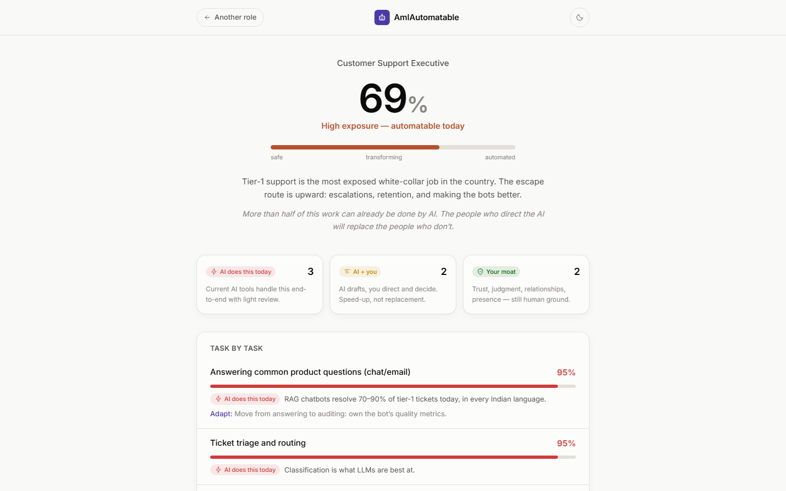

<div align="center">

# AmIAutomatable

**Which parts of your job can AI already do?**

Not someday. Today, with tools anyone can buy. An honest, task-by-task answer —
plus what to learn next.

</div>



## The problem nobody notices

Job displacement doesn't announce itself. Nobody taps you on the shoulder and
says "40% of your role got automated last quarter." It shows up later, sideways —
hiring freezes, "we're restructuring," a job search that inexplicably takes a
year.

The people who get hurt worst are the ones who never looked. Not because the
answer was hidden, but because the question felt uncomfortable.

This tool makes the question take 30 seconds. Pick your role — or paste your
actual weekly tasks — and get:

- **A task-by-task breakdown**: what AI does end-to-end today (🔴), what it
  turns into a copilot (🟡), and where your human moat is (🟢)
- **An overall exposure score**, calibrated to *shipping tools*, not lab demos
- **What to learn next**, in order of leverage

The point isn't fear. It's that automatable ≠ doomed — it means the shape of
the job is changing, and the people who see the shape early get to choose
their position in it.

## Two ways to use it

**1. Pre-analyzed roles (no signup, no key).** Nine common roles — accountant,
recruiter, support executive, content writer, junior developer, marketer, data
analyst, sales exec, teacher — hand-calibrated against what deployed AI tools
actually do in 2026.

**2. Your exact job (bring your own API key).** Paste your job title and real
weekly tasks; Claude analyzes them with the same calibration rubric. This is a
static page with **no backend** — your key lives in your browser's localStorage
and calls Anthropic directly. One analysis costs a few rupees.

## Run it

```bash
git clone https://github.com/<you>/amiautomatable
cd amiautomatable
npm install
npm run dev      # http://localhost:3000
npm test         # scoring + role-library test suite
npm run build    # static export to out/
```

Stack: Next.js 14 (static export) · TypeScript · Tailwind ·
[@anthropic-ai/sdk](https://github.com/anthropics/anthropic-sdk-typescript)
(browser mode, structured outputs). No backend, no analytics, no tracking.

## Calibration rubric

| Score | Meaning |
| --- | --- |
| 85–100 | Shipping tools do this end-to-end with light review |
| 60–84 | AI does most of it; a human directs and finishes |
| 35–59 | Real speed-up, but human judgment carries the outcome |
| 0–34 | Fundamentally human: trust, presence, accountability, relationships |

Overall exposure = mean across tasks. The custom analysis prompts Claude with
this exact rubric and returns schema-validated JSON (`output_config.format`),
so results are structurally guaranteed.

## Part of the "Unnoticed" series

Five problems people have but haven't noticed, five open-source tools, five
days. AmIAutomatable is **2 of 5**.

## License

MIT — fork it, rebrand it, show it to your team before your boss does.
